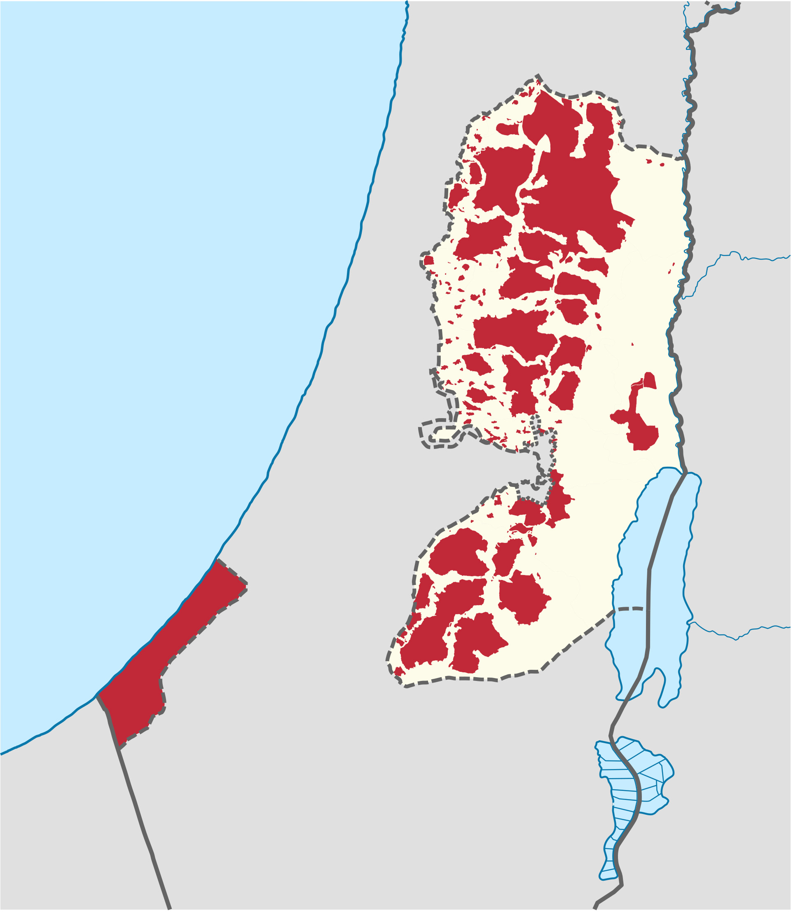
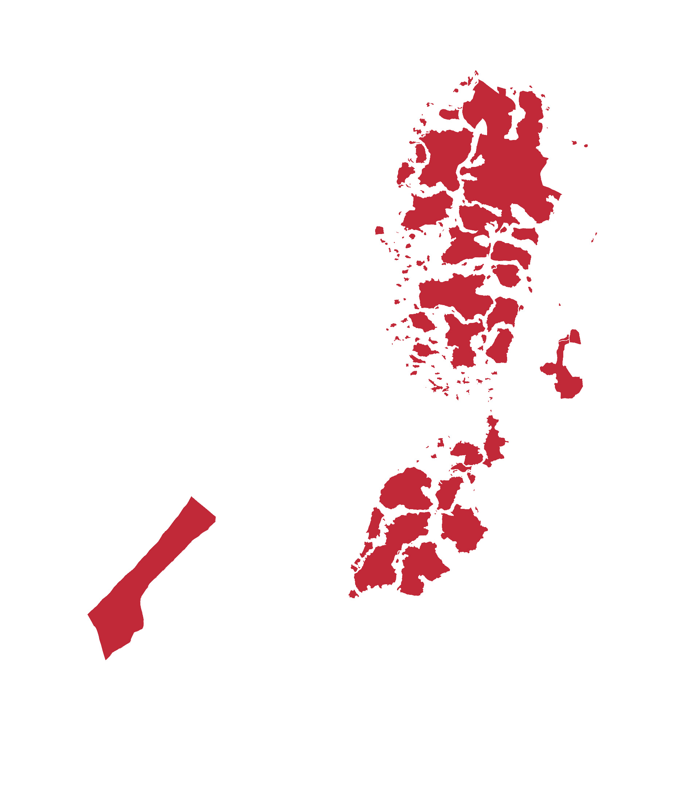
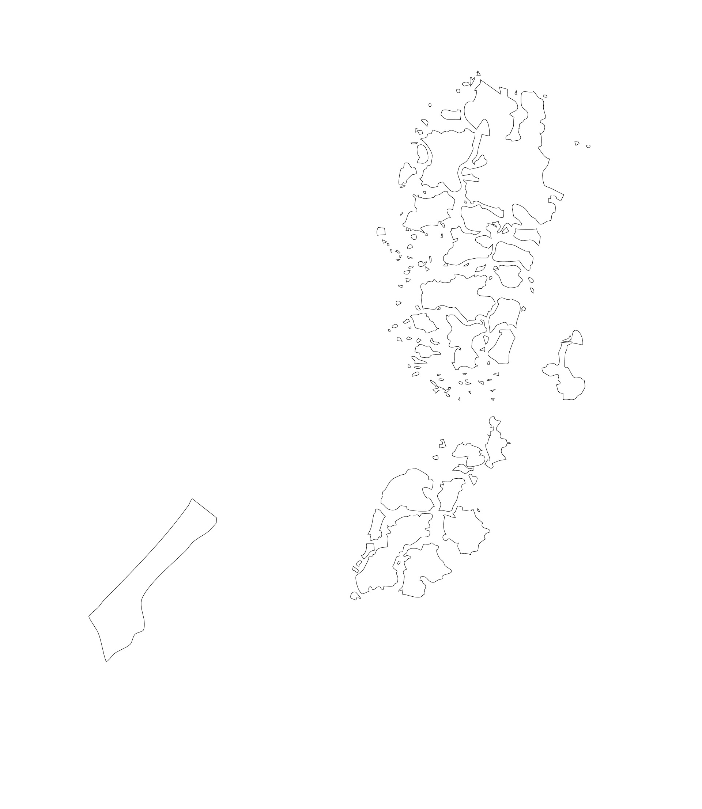
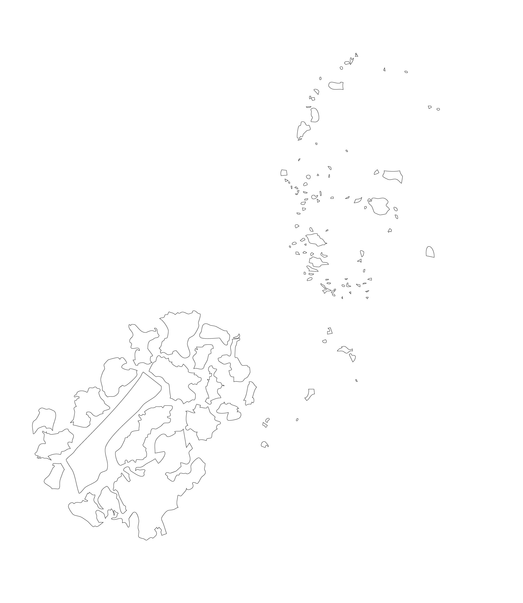
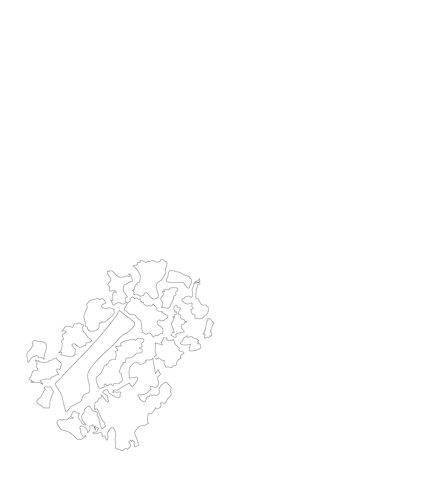
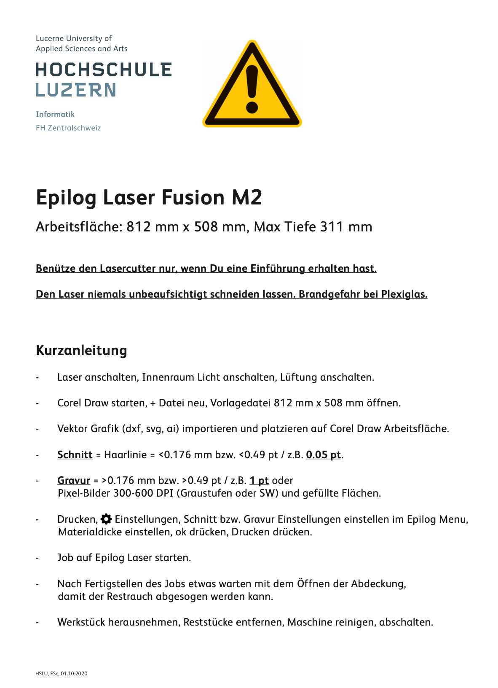
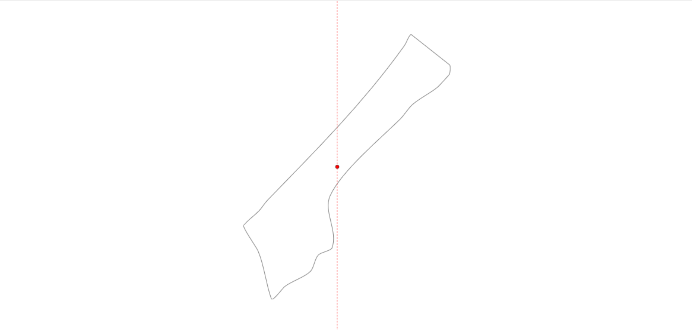
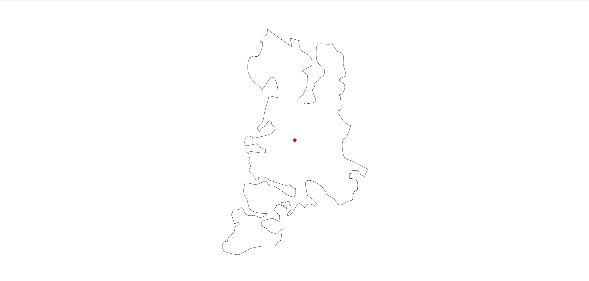
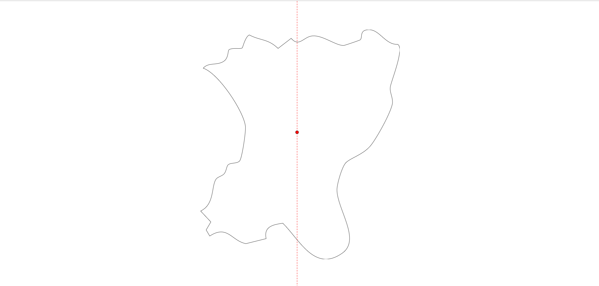

# Journal

## KW38

In dieser Woche wurde das [Briefing](../briefing/) erstellt. Ziel war es die erste Auseinandersetzung und Inspirationen sowie Referenzen zu finden.

## KW40 Laser Cutter Design

Die Scherben basieren auf einer Karte der palästinensisch kontrollierten Gebiete von Wikipedia.

Zunächst wurden die entsprechenden Regionen in Photoshop selektiert,

anschließend in Illustrator importiert und nur die Umrisse beibehalten.

Daraufhin wurden nur die outlines hinzu

Von den ursprünglich 115 einzelnen Stücken wurden schließlich 18 ausgewählt, arrangiert und für den Laser-Cutter vorbereitet.

[SVG File](../assets/images/laser/final.svg)

## KW40 Laser Cutter Einführung

Anbei die wichtigsten Infos für den Laser Cutter in Rotkreuz:

- [Werkstätten & Maker Space ](https://mycampus.hslu.ch/de-ch/info-i/infos-und-dokumente/werkstatt/)
- [Arbeitsplätze Reservation](https://mycampus.hslu.ch/de-ch/raum-i/arbeitsplaetze/)

## KW40 Room inspection / first Test with projection

Die Testteile, die während der Einführung des Laserschneiders hergestellt wurden, wurden zu Hause mit einem Projektor getestet. Es funktioniert recht gut; die Position spielt keine große Rolle, solange es gut abgebildet ist, und es deckt bis zu 180 Grad Drehung im Raum ab. Daher wurde beschlossen, einen Projektor für den Hintergrund zu verwenden, damit mehr Platz im Raum genutzt werden kann.

## KW40 Room Organization

Für die Installation wurde im DFK ein Raum organisiert, der jedoch nicht verschlossen werden kann. Es wird noch darüber diskutiert, ob in Rotkreuz ein Raum zur Verfügung gestellt werden kann. Der Raum im DFK ist ideal, und die Objekte könnten mit einer Leiter aufgehängt werden.

## KW40 Preparation on gather data #12

To begin collecting media, I created a dedicated folder and a reference list in the project documentation. This setup allows me to systematically gather, link, and review the collected media for deeper insights during future development phases.

## KW41 Finalize Room Organization

Für das Projekt habe ich den Raum 275 im 745 Reserviert. Den Aufbau findet am 23.10 statt und Abbau am 5.11, für dies wird eine Hebelbühne gebraucht.

## KW41 Prepare and Laser Cut Forms #34

Heute habe ich mit einem [Tool](../assets/images/laser/finalized/calculator.html) den Schwerpunkt (CG) meiner Objekte berechnet, um die Position der Aufhängelöcher zu bestimmen.  
Alle SVGs sind nun auf das jeweilige Format vorbereitet.  
Offen bleibt noch, wie groß die Löcher werden und ob ich sie bohre oder laserschneide.

3 von 11 Beispiele

Da jedoch leider das Material noch nicht da ist konnte ich es noch nicht laser cutten. Das wäre spätestens nächste Woche dann der Fall.

## KW42 Zwischenpräsentation #35

Heute habe ich die **Zwischenpräsentation** vorbereitet und den aktuellen Stand meines Projekts den Stakeholdern vorgestellt: [Präsentation ansehen](https://docs.google.com/presentation/d/1ELD9BH6NSSBnpdpugg4SJphPltaBJgH4Ccs251Yx5fE/edit?usp=sharing)

Das Feedback war hilfreich:

- Weniger Fokus auf Arduino, mehr auf das eigentliche Konzept.
- Plan B überlegen, falls kein Material geliefert wird.
- Eine klare Linie ziehen, damit die Darstellung der Palästinenser menschlich bleibt und nicht politisch vereinnahmt wird.

**Reflexion:**  
Es zeigt sich, dass ich die **konzeptionelle Ebene stärker betonen** muss, um den Stakeholdern ein klareres Bild zu geben. Außerdem muss ich **alternative Szenarien planen**, falls Materiallieferungen ausbleiben. Die ethische Dimension des Projekts ist für mich neu, aber wichtig: die Darstellung soll **Respekt und Menschlichkeit** vermitteln, ohne politische Instrumentalisierung.

**Nächste Schritte:**

- Präsentation überarbeiten und den Arduino-Fokus reduzieren.
- Plan B entwickeln für Materialmangel.
- Überlegen, wie ich die menschliche Darstellung visuell konsistent halten kann.

## Szenen und Themen

| Scene           | Visual Layers                                                                              | Audio                                                    | Narrative / Emotional Flow                                        | Interactive Elements                                                | Play / Projection Approach                                              | Red Line / Ethical Note                                                                |
| --------------- | ------------------------------------------------------------------------------------------ | -------------------------------------------------------- | ----------------------------------------------------------------- | ------------------------------------------------------------------- | ----------------------------------------------------------------------- | -------------------------------------------------------------------------------------- |
| Daily Life      | Streets, courtyards; people walking, children playing; smoke, moving shadows, gestures     | Ambient street sounds, chatter, birds, sewing, lullabies | Rhythm of everyday life; tenderness, resilience                   | Click objects for stories; mirror shards show micro-scenes          | Blend domestic soundscapes with projected faces/gestures; tender pacing | Focus on authentic human experiences; avoid political or Western-centric framing       |
| Celebrations    | Decorated halls/tents; dancing, rituals; confetti, flowing fabrics, light effects          | Traditional music, chants, laughter                      | Joy, unity, cultural traditions; smooth transitions               | Hover over people to reveal quotes; trigger music/motion            | Light reflections pulse to rhythmic dabke; still imagery fades in/out   | Emphasize human/cultural aspects; avoid political or Western framing                   |
| Displacement    | Landscapes, roads, urban ruins; groups moving, olive harvests, shepherds; floating objects | Footsteps, wind, distant vehicles, pastoral songs        | Journey and uncertainty; blends past/present; evoke calm          | Click objects for memory flashes; mirror shards reflect locations   | Warm lighting with natural sound loops; sunset/pastoral mood            | Highlight human journeys and labor; respect local context; avoid politicization        |
| Resistance      | Streets, banners; crowd movement, raised hands, posters; smoke, animated typography        | Crowd noise, chants, drumming, sirens                    | Collective action and emotion; tension with hope                  | Hover over protesters for quotes; trigger visuals/sounds            | Project fragmented slogans and rhythms; quiet reflective moments        | Show resilience and identity; avoid propaganda or Western-centric framing              |
| Faith & Rituals | Landmarks, ceremonial spaces; rituals/processions; candles, flags, ritual objects          | Chanting, prayers, bells                                 | Continuity, identity, shared values; reflective                   | Click ritual objects for stories; mirror shards reveal interactions | Crossfade spiritual sounds; interplay between religions and stillness   | Respect spiritual practices; no political/Western framing; focus on human authenticity |
| Markets         | Streets, marketplaces; vendors, pedestrians; flickering lights, floating objects           | Market chatter, footsteps, ambient sounds                | Energy, chaos, vibrancy; daily life                               | Click stalls/objects for micro-stories; mirror reflections          | Layer sounds and light flickers to create sensory collage               | Highlight urban human experience; avoid political/external ideological bias            |
| Memory & Radio  | Archives, personal spaces; photos, objects; reflections and light fragments                | Voices, radio tones, crackling recordings                | Intimate memory space; fading in/out; personal recollection       | Click objects to trigger audio; mirror shards for reflections       | Dim light reflections; layered overlapping voices                       | Focus on memory and human narratives; avoid politicization; respect local voices       |
| Theatre         | Small stages, theatrical spaces; actors/performers; light and mirror effects               | Dialogue, ambient stage sounds                           | Visitors activate performance fragments; interactive storytelling | Movement triggers performance/audio; mirror shards act as stages    | Mirrors act as small stages; light mimics stage presence                | Emphasize art and human expression; avoid political or Western-centric framing         |

## KW42 – Einstieg in TouchDesigner & erste Projektion

Heute habe ich mich erstmals mit **TouchDesigner** beschäftigt, um die Projektion für meine Spiegel-Scherben vorzubereiten.  
Ich habe mehrere **Movie File In TOPs** (Video + Masken) erstellt, sie über **Composite** und **Transform TOPs** kombiniert und anschließend alles in einem **Null TOP** zusammengeführt.

Danach habe ich gelernt, wie man die Ausgabe über eine **Perform Window** auf den **Projektor** legt.  
So konnte ich den grundlegenden Ablauf verstehen – von der Videoquelle bis zur sichtbaren Projektion.

Nächster Schritt: mehrere Scherben ansteuern und erste Interaktionen testen.

## KW43 - Lasercutten

Heute wurden die Spiegel mit dem Lasercutter zugeschnitten. Alles hat gut funktioniert, und die Spiegel wurden direkt zu Hause mit einer Testsequenz ausprobiert. Bin sehr zufrieden mit dem Ergebnis.

## KW43 - erste Montage

Die Formen wurden für das Bohren vorbereitet. An einem Teststück habe ich ausprobiert, ob das Bohren in die Spiegel funktioniert – es hat funktioniert. Ich habe die Löcher entlang der zuvor berechneten Schwerkraftlinie gebohrt, darauf geachtet, dass alles sauber aussieht, und die Ringe eingesetzt.

Mit den Angelschnüren und den drehbaren Teilen habe ich die Komponenten miteinander verbunden. Wie genau die beiden Spiegelstücke miteinander verbunden werden, ist noch offen; ich könnte je nach Aufwand und Beständigkeit Kleber oder Klebeband verwenden.

Am Wochenende werden basierend auf Tests und Optimierungen noch kleinere Anpassungen vorgenommen, damit die Installation nächste Woche richtig aufgebaut werden kann.

## KW44 - Room Setup

Beim Aufstellen der Spiegel entlang einer horizontalen Linie ist leider die Schnur gerissen, wodurch einige Spiegelstücke zu Boden fielen und beschädigt wurden. Deshalb musste improvisiert werden: Die noch intakten Spiegel wurden vertikal aufgehängt. Das führte jedoch dazu, dass der Hauptbeamer nicht mehr genutzt werden konnte. Daher wurde entschieden, den Beamer, der ursprünglich für die hintere Wand vorgesehen war, als Hauptbeamer zu verwenden. Mit einem Stativ funktionierte das gut – nun muss allerdings noch überlegt werden, wie die Projektion optimal umgesetzt werden kann.
